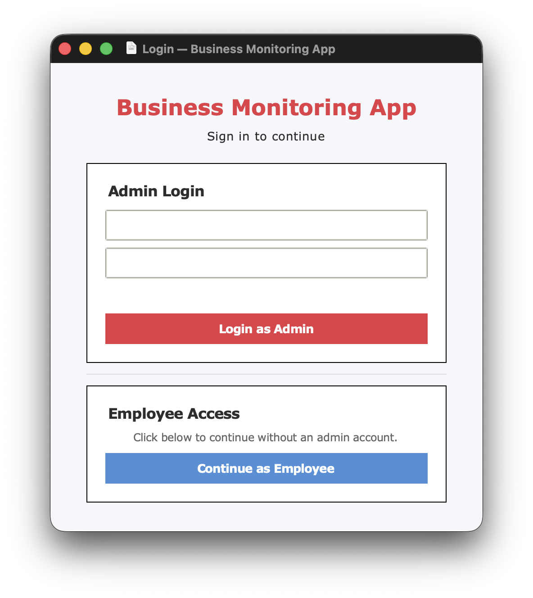
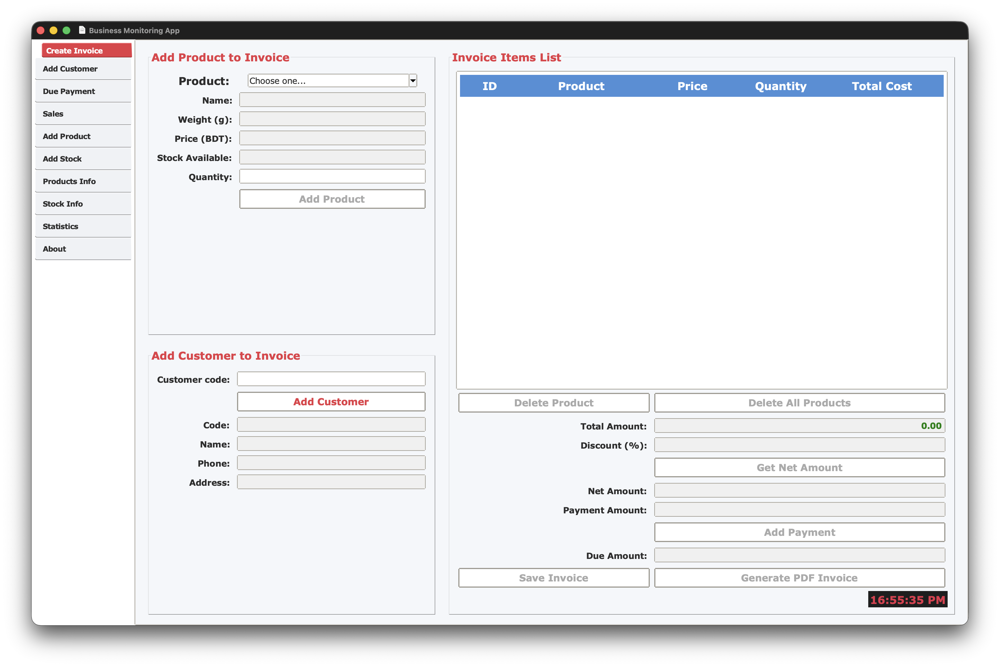

# Business Monitoring App

A desktop business management application built with Python and Tkinter — one of my first real projects, written while I was actively learning to code.

---

## Screenshots

| Login Screen | Main Dashboard |
|---|---|
|  |  |

---

## What It Does

The Business Monitoring App is a full-featured desktop tool designed to manage the day-to-day operations of a small business. It covers the complete product-to-invoice workflow in a single offline application:

- **Create Invoices** — Add products and customers to an invoice, apply discounts, record payments, and generate a printable PDF invoice
- **Customer Management** — Add and track customers with code, name, phone, and address
- **Due Payment Tracking** — Monitor outstanding balances per customer
- **Sales Records** — View and audit past sales transactions
- **Product Management** — Add products with weight and pricing details
- **Stock Control** — Add stock and monitor live availability
- **Product & Stock Info** — Browse full inventory with current stock levels
- **Statistics** — Business overview with aggregated numbers
- **Role-Based Access** — Separate Admin and Employee login modes with different permission levels
- **PDF Invoice Generation** — Export invoices as print-ready PDF documents
- **Excel Export** — Export data to `.xlsx` spreadsheets

---

## Tech Stack

| Layer | Technology |
|---|---|
| Language | Python 3 |
| GUI Framework | Tkinter + ttk |
| Database | SQLite 3 (via `sqlite3` stdlib) |
| PDF Generation | ReportLab |
| Excel Export | XlsxWriter |
| Number-to-Words | num2words |
| Timezone Handling | pytz |

No web framework, no external UI library — everything is built on Python's standard library GUI toolkit.

---

## Project Structure

```
BusinessMonitoringApp/
├── run.py                  # Entry point
├── requirements.txt
├── assets/                 # DB file, app icon, logo
└── app/
    ├── config.py           # Paths, brand constants
    ├── database/
    │   └── connection.py   # SQLite context manager
    ├── models/             # Data access layer (product, customer, sale, stock, due)
    ├── ui/
    │   ├── login.py        # Login & super-admin registration window
    │   ├── app.py          # Main application window + tab layout
    │   ├── controller.py   # UI event logic
    │   ├── styles.py       # All ttk styles & light-mode colour palette
    │   ├── widgets.py      # Reusable widget factory helpers
    │   └── views/          # One file per tab (home, customer, product, stock, sale, …)
    └── utils/
        ├── invoice.py      # PDF invoice generation
        └── excel.py        # Excel export
```

---

## Getting Started

**Requirements:** Python 3.10+ with Tk support.

> On macOS, install Tk via Homebrew if needed:
> ```bash
> brew install python-tk
> ```

```bash
# 1. Clone the repository
git clone https://github.com/devshakib/BusinessMonitoringApp.git
cd BusinessMonitoringApp

# 2. Create and activate a virtual environment
python3 -m venv .venv
source .venv/bin/activate      # Windows: .venv\Scripts\activate

# 3. Install dependencies
pip install -r requirements.txt

# 4. Run the app
python run.py
```

On first launch, the app will prompt you to create a **Super Admin** account before the login screen appears.

---

## What I Learned Building This

This project was built while I was in the early stages of learning programming. Here's what it reflects:

**Python fundamentals** — variables, functions, classes, modules, file I/O, exception handling, and working with the standard library across a non-trivial codebase.

**Object-Oriented Programming** — the entire app is structured around classes; each view, model, and utility is its own encapsulated unit.

**Database design** — designed and queried a relational SQLite schema from scratch, including joins, aggregations, and parameterised statements to avoid SQL injection.

**Desktop GUI development** — built a fully functional multi-tab GUI application using Tkinter and ttk, including custom styles, responsive layouts, treeviews, and themed widgets — without any third-party UI framework.

**Software architecture** — refactored a 3 500-line monolith into a clean MVC-style structure with separated models, views, UI infrastructure, and utilities spread across 30+ files.

**PDF & spreadsheet generation** — programmatically generated print-ready PDF invoices using ReportLab and Excel reports using XlsxWriter.

**Practical problem solving** — handled platform-specific quirks (macOS Tkinter rendering), timezone-aware date handling, role-based access control, and real-world business logic like discount calculation and due payment tracking.

---

## License

[MIT](LICENSE)
