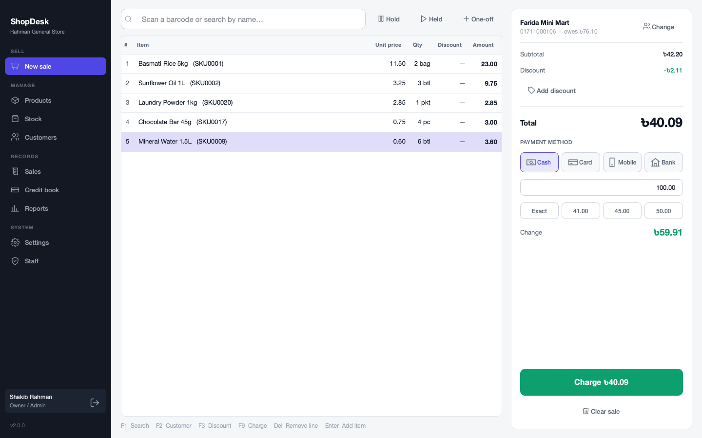
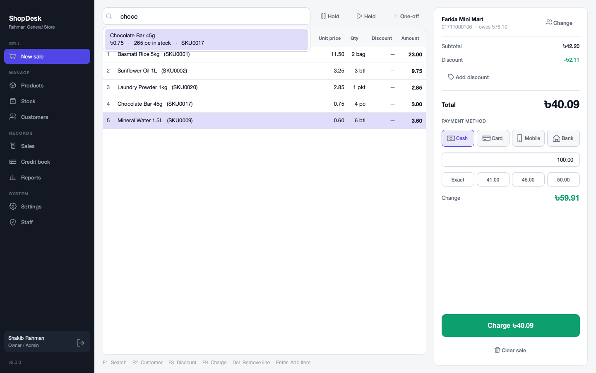
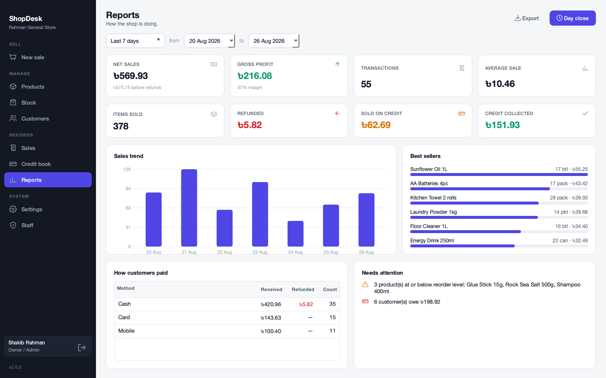
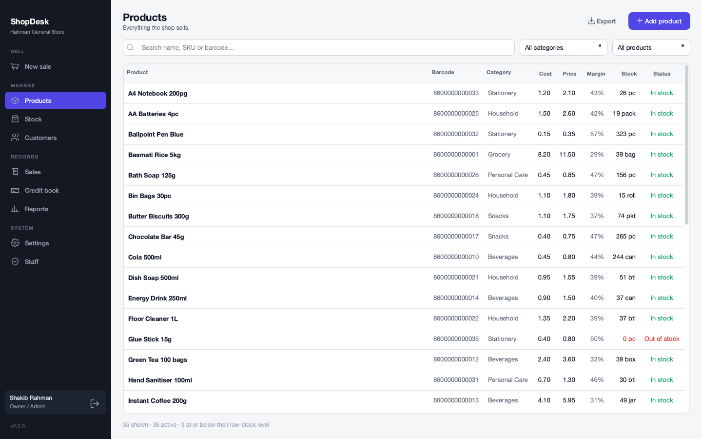
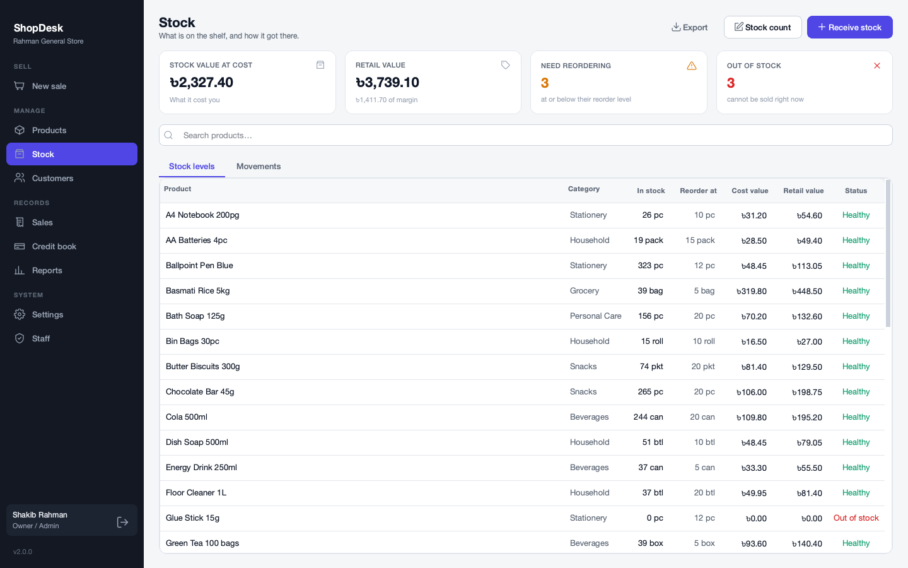
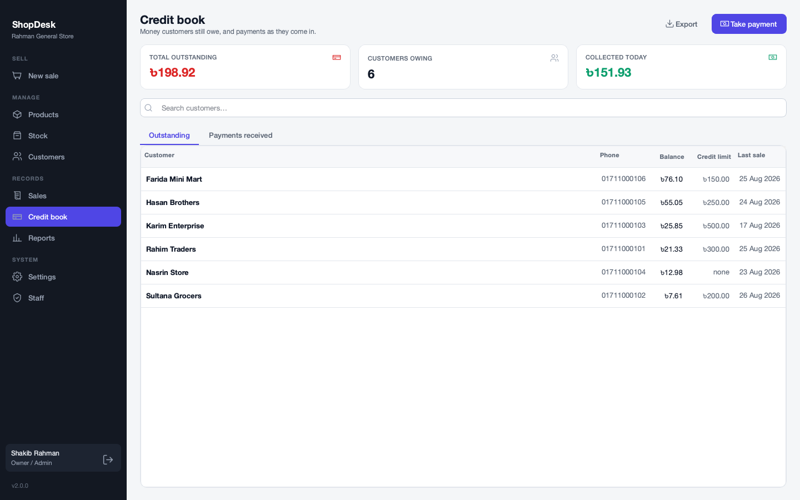
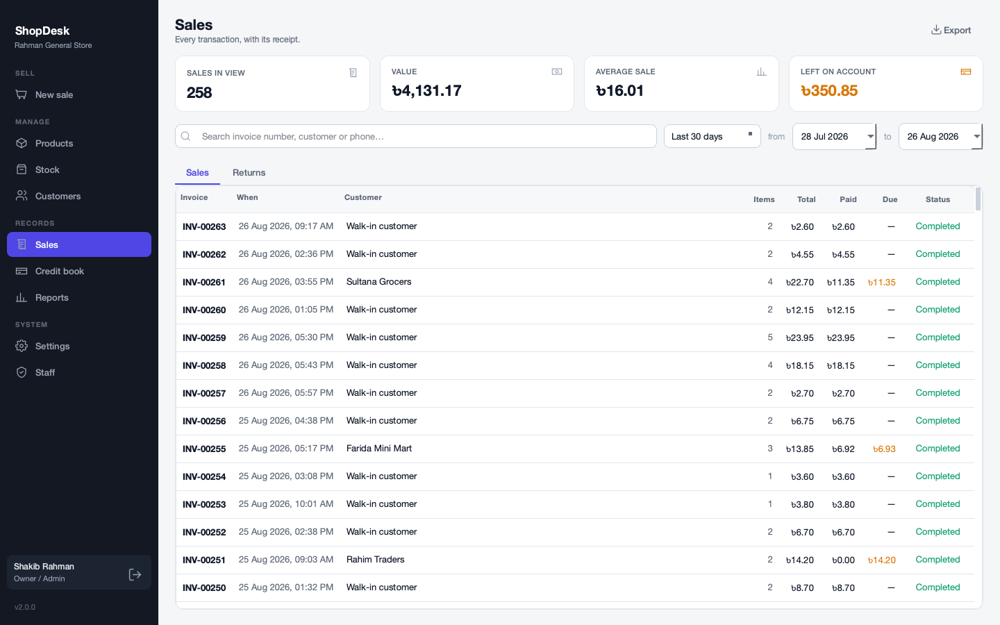
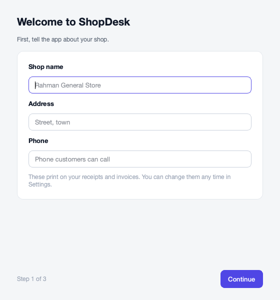
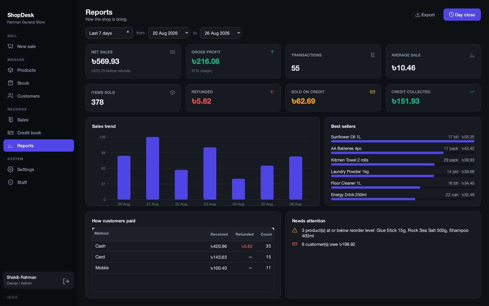

<div align="center">

# ShopDesk

**A point-of-sale application for small shops.** Free, offline, and yours to download.

[](https://github.com/devShakib015/BusinessMonitoringApp/actions/workflows/tests.yml)
[](https://github.com/devShakib015/BusinessMonitoringApp/actions/workflows/release.yml)
[](LICENSE)




</div>

---

## Download

Grab the latest build from the [**Releases**](https://github.com/devShakib015/BusinessMonitoringApp/releases) page:

| File | What it is |
|---|---|
| `ShopDesk-x.y.z-Setup.exe` | Windows installer. Adds a Start-menu entry and uninstalls cleanly. |
| `ShopDesk-x.y.z-portable.exe` | One file. Runs from a USB stick — put a `portable.txt` next to it to keep the shop data beside the executable. |

Windows SmartScreen will warn about an unsigned application; choose **More info → Run anyway**. There is no account to create, nothing to activate, and no internet connection required. Your shop's data is a single SQLite file in `%LOCALAPPDATA%\ShopDesk` that never leaves the computer.

On macOS and Linux, [run it from source](#running-from-source).

---

## What it does

**At the counter**
- Scan a barcode or type a few letters — matches appear as you type, `Enter` adds the top one
- Type `3*cola` to add three of something at once
- Cash, card, mobile money or bank transfer, with change worked out for you
- Quick-cash buttons (`Exact`, next round number up) so the change is one click
- Hold a sale and pick it up later when a customer goes back for the milk they forgot
- One-off lines for things that aren't in the catalogue — a delivery charge, a photocopy
- Whole-sale or per-line discounts, spread across lines so tax and refunds stay correct
- Keyboard-first: `F1` search · `F2` customer · `F3` discount · `F9` charge · `Del` remove line

**Money and stock**
- Products with barcode, SKU, category, cost and selling price, and a low-stock level
- Sell by the piece, the kilo or the litre — `1.5 kg` is a real quantity
- Stock is a ledger, not a number: every unit that moved has a row saying why
- Receive deliveries, run a stock count, write off damage
- Returns that put stock back and refund in cash or credit the customer's account
- Void a sale, with a reason, and the stock goes back on the shelf

**Customers and credit**
- Walk-in by default — attaching a customer is optional, never required
- Put a sale on the book, collect against the balance later, set a credit limit per customer
- A statement for each customer: what they bought, what they paid, what's left

**Paperwork**
- Thermal receipts on 80mm or 58mm rolls, printed through any printer Windows knows about
- A4 PDF invoices with your logo, for customers who need a document
- Every list exports to Excel

**Running the shop**
- A dashboard of net sales, gross profit, best sellers, and how people paid
- Day close: what the till should hold, against what you counted
- Low stock, unpaid balances and lines that haven't sold in a month, surfaced without asking
- Admin and cashier roles — cashiers can sell but can't change prices or see profit
- One-click backups, and restore from any of them
- Light and dark, six accent colours, twenty currencies, tax on or off

---

## Screenshots

| | |
|---|---|
|  **Find anything by typing** |  **Know how the shop is doing** |
|  **The catalogue** |  **Stock, with its history** |
|  **Who owes what** |  **Every sale, with its receipt** |
|  **Three questions to get started** |  **Dark mode** |

---

## How a sale actually goes

```
Scan a barcode                      line added, quantity merged if it repeats
Type "milk", press Enter            top match added
Press F2, pick a customer           optional — walk-in is the default
Press F3, type 10                   10% off, split across the lines
Type what they handed you           change appears as you type
Press F9                            sale saved, stock moved, receipt offered
```

A cash sale for a walk-in is a scan and one key.

---

## Running from source

Python 3.10 or newer.

```bash
git clone https://github.com/devShakib015/BusinessMonitoringApp.git
cd BusinessMonitoringApp

python3 -m venv .venv
source .venv/bin/activate        # Windows: .venv\Scripts\activate

pip install -r requirements.txt
python run.py
```

On first launch a three-step wizard asks for the shop name, the currency, and an owner account. Tick **fill the shop with sample data** and you get a month of example trading to click around in — you can erase it later from **Settings → Data and backups**.

```bash
python run.py --selftest   # headless check: drives a whole sale and renders a receipt
```

---

## How it is built

```
run.py                  launch, or --selftest
app/
  config.py             version, and where data lives on each platform
  core/                 db + migrations, settings, money, quantity, passwords, clock
  repo/                 all the SQL: products, stock, customers, sales, payments, reports
  services/             cart, checkout, returns, dues, backups, held sales, sample data
  printing/             thermal receipts (Qt) and A4 PDF invoices (ReportLab)
  export/               Excel
  ui/                   PySide6: theme, icons, main window, pages, dialogs, widgets
tests/                  81 tests: money, cart, checkout, returns, data — and every screen
packaging/              PyInstaller spec, Inno Setup script, icon and version generators
```

Roughly 8,900 lines. The UI is a third of it; the rules a shop cares about live under
`core/`, `repo/` and `services/`, where they can be tested without opening a window.

**A few decisions worth knowing about:**

- **Money is never a float.** Every amount is an integer number of minor units. `0.1 + 0.2` is not `0.3`, and a till that is a paisa out a hundred times a day is a till nobody trusts. Discounts spread across lines are allocated so the parts add up to exactly the whole.
- **Stock is a ledger.** There is no `quantity` column on a product; the level is the sum of its movements, each with a reason and a link back to the sale or return that caused it. That turns "why is this wrong?" into a question with an answer.
- **A sale is one transaction.** The invoice number, the header, the lines, the payment and the stock movements all land together or not at all.
- **The database is built on first run**, not shipped in the repository. A fresh download starts with an empty till and no stranger's data.
- **Passwords are salted PBKDF2-SHA256 digests**, so copying the database file does not hand over the owner's password.
- **Your data stays put.** It lives outside the installation folder, so it survives updates, and nothing is ever uploaded anywhere.

### Tests

```bash
pip install -r requirements-dev.txt
pytest tests -v
```

The suite covers the parts where being wrong costs a shop money: rounding, discount
allocation, inclusive and exclusive tax, stock movement, credit limits, partial
returns, refunds against an account, and that a sale which fails leaves nothing behind.

It also builds every screen and dialog against a real database on Qt's offscreen
platform, which is what catches a page that breaks on an empty table or a dialog
that has drifted from the code behind it.

### Building the Windows release

Pushing a `v*` tag builds and publishes automatically. To do it by hand on Windows:

```bash
pip install -r requirements-dev.txt
python packaging/make_icon.py
python packaging/make_version.py
pyinstaller packaging/shopdesk.spec --noconfirm --clean
iscc packaging\installer.iss /DAppVersion=2.0.0
```

---

## History

This repository started as *Business Monitoring App* — a Tkinter program written for one
particular shop while I was learning to program, with the shop's own details compiled
into the source and its database committed to git. Version 2 keeps the idea and the
domain, and rebuilds the rest: a PySide6 interface, a real schema with migrations,
integer money, a stock ledger, returns, roles, backups, tests, and a Windows build
anyone can download.

The original Tkinter version is still in the history, at
[`b95a81f`](https://github.com/devShakib015/BusinessMonitoringApp/tree/b95a81f).

---

## Licence

[MIT](LICENSE) — use it, sell with it, change it.
