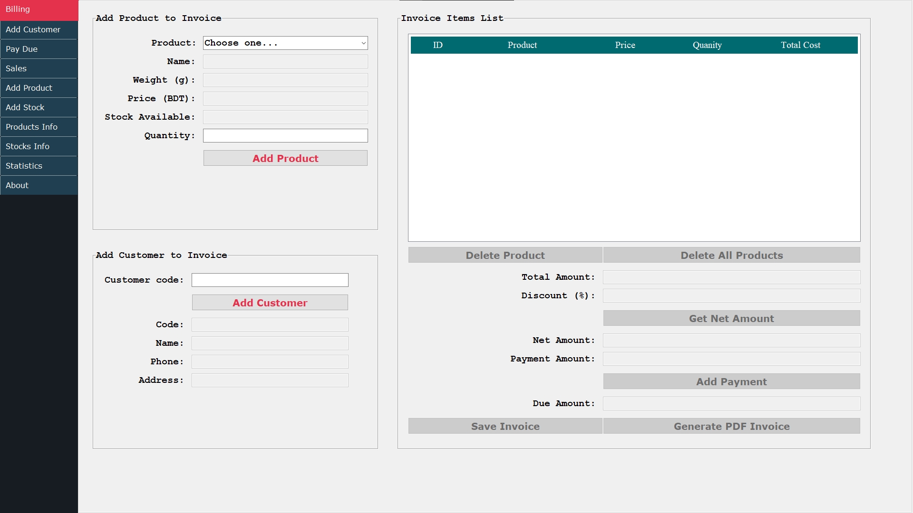

# Business Monitoring App

This software will keep track of your small business activities.

Features:

    1. Generate PDF Invoice
    2. Save customer information
    3. Save sales information
    4. Save products information
    5. Save stocks information
    6. Save Dues information
    7. Generate the cost price of the product
    8. Generate the gross profit of the business
    9. Generate Due invoice
    10. Generate excel sheets for the customer, product or sales list
    11. Can search for all the information for single day or month or year
    13. And it has some more features that cannot be explained here... You can see when you will use it. 

It's a complete functional software for small shop, or small businesses. It's very usefull and it's very easy to use.

 
